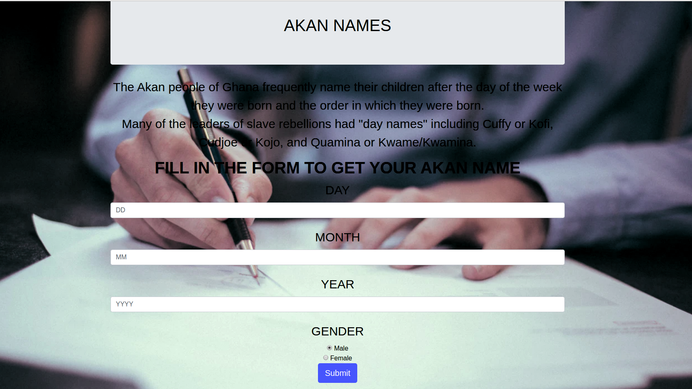
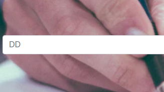
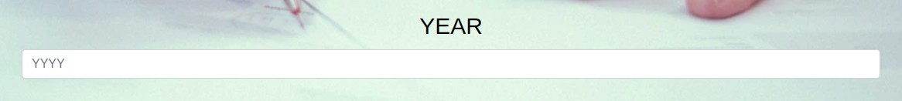

## Project name.
- AKAN NAMES
## Project description.
- The project is basically explains how one can get his/her name in Akan names in Ghanian depending with gender and the time he/she was born.
## Author(s) information.
 - KEBASO STEVE ONGATI
## Setup instructions 
 - You need to have your folder that contains the css, images,js and the style.css in order to have your website.
 - The website requires data in order to function.

## Technology Used
 - HTML-We used html for displaying the content.
 - CSS-We used css and bootstrap for styling the front-end of the website and making the landing page.
 - JAVASCRIPT-We used javascript for dynamics.

## BDD.

 - Basically this is the the landing page of the Akan Names website where the user gets to know more about the website function and how the user will interact with it.

 - This is a place holder where one enters the date of the day that one was born in order to be read in the website.
 - The dates are written in numbers e.g ; 12.

 -  This is a place holder where one enters the month of the year that one was born in order to be read in the website.
 - The month is written in numbers e.g ; 12.

 

 -  This is a place holder where one enters the year  that one was born in order to be read in the website.
 - The year is written in numbers e.g ; 1998.

 - At the gender one is required to click on his/her sex where he/she belongs and then submit at the submit button in order to get his/her name in Ghanian Akan Names.
 - Finally after submiting your datails you Akan Name will be displayed below the submition button.
 - Exampple; You were born on Saturday,your akan name is Kwame.

## Project's live Link
 - Github link: https://kebasoh.github.io/AkanNames/
## Contact information.
 - Email: ongatikebaso@gmail.com.
 - Phone-No: 0797657305/0795663799.
## License and Copyright information.
 - MIT License Copyright (c) 2019 (Kebaso Steve Ongati)
 - - 